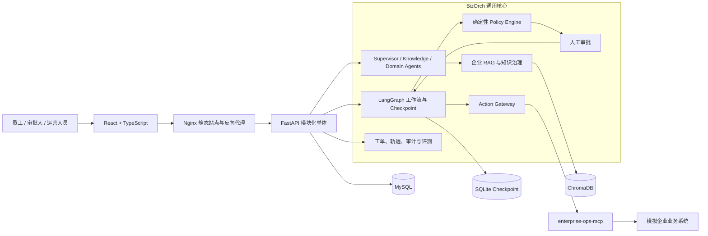

# BizOrch

> 面向跨行业企业的智能服务与业务流程自动化平台。


BizOrch 将大模型的业务理解能力与企业中的确定性规则、人工审批和受控系统操作结合起来，完成“理解请求—检索制度—查询业务事实—生成操作计划—审批中断/恢复—安全执行—结果验证—审计追踪”的完整闭环。

它不是单纯的 RAG 问答机器人，也不允许大模型直接修改企业数据。项目重点回答的问题是：**AI 如何在企业约束下，安全地推动业务状态变化。**

## 技术栈

### AI 应用与后端


### 前端


### 数据、RAG 与企业集成


### 质量与交付


## 项目亮点

- **多场景企业 Agent 平台**：已实现系统权限申请、工业设备报修与维护、员工入职/调岗/离职协同、采购与办公申请四个场景包，复用同一套工作流、审批、工单、审计与受控执行核心。
- **多 Agent 职责隔离**：Supervisor 负责意图识别和字段提取，Knowledge Agent 负责企业制度检索，Domain Agent 仅查询权威业务事实；Agent 不拥有企业写权限。
- **企业级 RAG 治理**：支持知识空间隔离、文档版本、生效/失效时间、发布与索引状态分离、角色/用户可见范围、混合检索、引用来源和检索审计。
- **LangGraph 人工中断与恢复**：流程可在信息缺失、等待审批或结果未知时持久化暂停；审批完成后从原 checkpoint 恢复，而非重新执行整条流程。
- **Action Gateway 受控写入**：所有副作用操作都要经过权限、Policy、审批、版本、最新事实、幂等和写后验证检查。
- **MCP 企业集成边界**：通过独立 `enterprise-ops-mcp` 暴露受控工具，对接独立模拟企业系统；读工具与写工具按能力分离。
- **可恢复的一致性设计**：跨系统调用不伪造全局事务；使用持久化幂等键、操作版本、执行记录、结果核对和人工接管处理超时、重复请求与部分失败。
- **评测与 Bad Case 治理**：提供版本化固定评测集、受限在线只读评测、基线对比、Bad Case 归档/复测和故障注入，评测不会进入企业写操作链路。
- **Linux 容器化交付**：API、模拟企业系统、MCP 和知识索引 Worker 使用 Docker Compose 管理；React 生产构建由 Nginx 提供，MySQL、Redis 与 Nginx 复用宿主机已有实例。

## 业务场景

| 场景 | 典型请求 | 关键能力 |
| --- | --- | --- |
| 企业系统权限申请 | 申请 CRM/ERP 临时权限 | 权限最小化、直属领导审批、授权幂等、写后核验 |
| 工业设备报修与维护 | 上报设备振动、异响、停机风险 | 设备事实查询、风险分级、维修工单、设备负责人审批 |
| 员工生命周期协同 | 入职、调岗、离职 | 不可变组合计划、跨系统步骤编排、部分失败停止与人工接管 |
| 采购与办公申请 | 申请办公耗材、预算预占 | 成本中心核验、金额分级、1～3 级串行审批、预算原子预占 |

## 整体架构



### 写操作安全链

```text
员工自然语言请求
  → Agent 提取字段与查询证据
  → Domain Agent 查询权威业务事实
  → Policy Engine 生成确定操作计划
  → 人工审批（绑定计划版本与内容摘要）
  → 执行前重新查询最新事实
  → Action Gateway 持久化幂等预留
  → MCP/HTTP 写工具调用
  → 独立查询验证实际结果
  → 更新工作流、工单与审计轨迹
```

其中大模型不能决定审批结果、不能绕过 Policy、不能直接调用企业写工具。网络超时或结果无法确认时，流程进入人工核对，而不是盲目重试。

## 项目结构

```text
BizOrch/
├── frontend/                # 独立 React 前端工程
├── backend/
│   ├── app/
│   │   ├── actions/         # Action Gateway、幂等与写后验证
│   │   ├── agents/          # Supervisor、Knowledge 与场景 Agent 编排
│   │   ├── approval/        # 单级/串行审批、版本绑定与恢复协调
│   │   ├── knowledge/       # RAG、知识治理与索引任务
│   │   ├── scenarios/       # 四类业务场景包
│   │   ├── tickets/         # 服务请求、工单与查询投影
│   │   └── workflow/        # LangGraph、状态机、checkpoint 与 SSE 进度
│   ├── migrations/          # Alembic 数据库迁移
│   └── tests/               # 后端单元、集成与 E2E 测试
├── enterprise_system/       # 独立模拟企业业务系统
├── enterprise_ops_mcp/      # MCP Server 与客户端适配层
├── evaluations/             # 版本化固定评测套件与 Bad Case 数据
├── demo_data/               # 虚构制度文档和演示数据
├── deploy/                  # Docker、Compose、Nginx 与 Linux 部署脚本
└── .env.example             # 环境变量模板（不含真实凭证）
```

## 本地运行

### 1. 前置条件

- Python 3.14.3；
- Node.js 24；
- 可访问的 MySQL 8 数据库；
- 可选 Redis 7；
- 用于 Agent 的 DeepSeek API Key，以及用于知识向量化的百炼 API Key；
- Docker Desktop（仅在容器联调或构建镜像时需要）。

复制环境变量模板并填写本地配置。`.env` 仅保存在本机，绝不能提交到 Git。

```powershell
Copy-Item .env.example .env
python -m venv .venv
& '.\.venv\Scripts\python.exe' -m pip install -r backend\requirements-dev.txt
& '.\.venv\Scripts\python.exe' -m alembic -c backend\alembic.ini upgrade head
Set-Location frontend
npm install
```

### 2. 启动开发环境

本地完整业务链路需要分别启动模拟企业系统、MCP、BizOrch API、知识索引 Worker 和前端。

```powershell
# 终端 1：模拟企业系统
& '.\.venv\Scripts\python.exe' -m uvicorn enterprise_system.app.main:create_runtime_app --factory --env-file .env --host 127.0.0.1 --port 8100
```

```powershell
# 终端 2：MCP 服务
& '.\.venv\Scripts\python.exe' -m enterprise_ops_mcp
```

```powershell
# 终端 3：BizOrch API
& '.\.venv\Scripts\python.exe' -m uvicorn app.main:app --app-dir backend --host 127.0.0.1 --port 8000 --reload
```

```powershell
# 终端 4：知识索引 Worker（上传或重建知识时需要）
& '.\.venv\Scripts\python.exe' backend\run_knowledge_index_worker.py
```

```powershell
# 终端 5：React 前端
Set-Location frontend
npm run dev
```

访问：

- 前端：`http://127.0.0.1:5173`
- API 健康检查：`http://127.0.0.1:8000/api/v1/health`
- OpenAPI 文档：`http://127.0.0.1:8000/docs`

评测 Worker 按需单独运行。默认仅执行不调用外部模型的合同评测；使用 `--live` 前必须明确确认会产生外部模型/嵌入调用，并且该模式仍只有只读能力。

```powershell
& '.\.venv\Scripts\python.exe' backend\run_evaluation_worker.py
# 在线只读评测（会产生外部调用）
& '.\.venv\Scripts\python.exe' backend\run_evaluation_worker.py --live
```

### 3. 导入演示知识

`demo_data/knowledge/` 中提供虚构企业制度和设备维护文档。配置 `DASHSCOPE_API_KEY` 后可导入：

```powershell
& '.\.venv\Scripts\python.exe' backend\seed_demo_knowledge.py
```

该命令会调用百炼嵌入接口并写入 ChromaDB。重复导入会依据来源、版本和内容进行幂等处理。

## 测试与评测

```powershell
# 后端测试
& '.\.venv\Scripts\python.exe' -m pytest backend\tests -q

# 前端测试、类型检查和生产构建
Set-Location frontend
npm test
npm run typecheck
npm run build
```

固定评测默认进行离线合同校验，不调用模型或企业写工具：

```powershell
& '.\.venv\Scripts\python.exe' backend\run_evaluations.py
& '.\.venv\Scripts\python.exe' backend\run_evaluations.py --suite v3_knowledge_governance
```

在线评测仅用于受限的模型质量抽样，必须显式执行 `--live`，并受案例数、超时、调用量和只读权限限制。

## Docker 与 Linux 部署

`2026.09.24-1` 已部署到 2 核 2GB 阿里云 Linux 服务器；本地 Compose E2E、线上健康检查、演示身份权限检查与持久化挂载读写检查已通过。知识入库和完整 Agent 流程的资源峰值、重启恢复及实际回滚演练仍待验收：

- `bizorch-api`：FastAPI、业务工作流和 Agent 编排；
- `enterprise-system`：独立模拟企业业务系统；
- `enterprise-ops-mcp`：MCP 工具协议服务；
- `knowledge-index-worker`：异步知识切分、远程嵌入和 Chroma 索引；
- Nginx：宿主机提供 React 静态文件并将 `/api` 反向代理至 API 容器。

MySQL、Redis 和 Nginx 复用服务器已有实例。Chroma、上传文件和 SQLite checkpoint 通过宿主机持久化目录挂载，镜像更新或回滚不会清除业务数据。

完整的镜像构建、离线 tar 包交付、环境变量、健康检查、回滚和 2 核 2GB 资源约束见 [部署操作手册](deploy/README.md)。

## 安全与设计约束

- 模型输出必须经过 Pydantic Schema 校验，明确字段可由确定性规则提取作为稳定兜底；
- 知识文档和工具返回均视为不可信输入，不能以文档中的指令绕过审批或 Action Gateway；
- 所有企业写操作都经过权限检查、Policy、审批、操作版本、事实复查、幂等与写后验证；
- 审批绑定不可变操作计划的 ID、版本和内容摘要，计划变化会使旧审批失效；
- 超时、协议异常或验证失败会进入结果未知/人工处理，不盲目重试；
- MCP 只在内部 Docker 网络中暴露；读模型 Agent 不持有写工具能力；
- 模型隐藏思维过程、密码、令牌、密钥和企业内部幂等键不会在前端轨迹或日志中展示；
- OSS 凭证只由服务器环境变量注入，浏览器不直接持有对象存储凭证。

## 已知边界

- 项目中的企业组织、设备、权限、预算和制度均为演示用虚构数据；
- 目标环境为 2 核 2GB 的低并发演示服务器，不以高并发生产负载为目标；
- 不实现通用工作流 DSL、低代码设计器、多租户 SaaS、Kubernetes 或复杂审批流；
- 当前不模拟权限自动到期回收、完整 HRMS、商城/支付/物流或真实 ERP；
- 文本型 PDF 支持解析；OCR、扫描件和复杂表格识别不在当前范围。

## 许可证

本项目用于个人学习、作品集展示与求职面试。若计划用于商业或团队协作，请先补充明确的开源许可证和第三方依赖合规说明。
